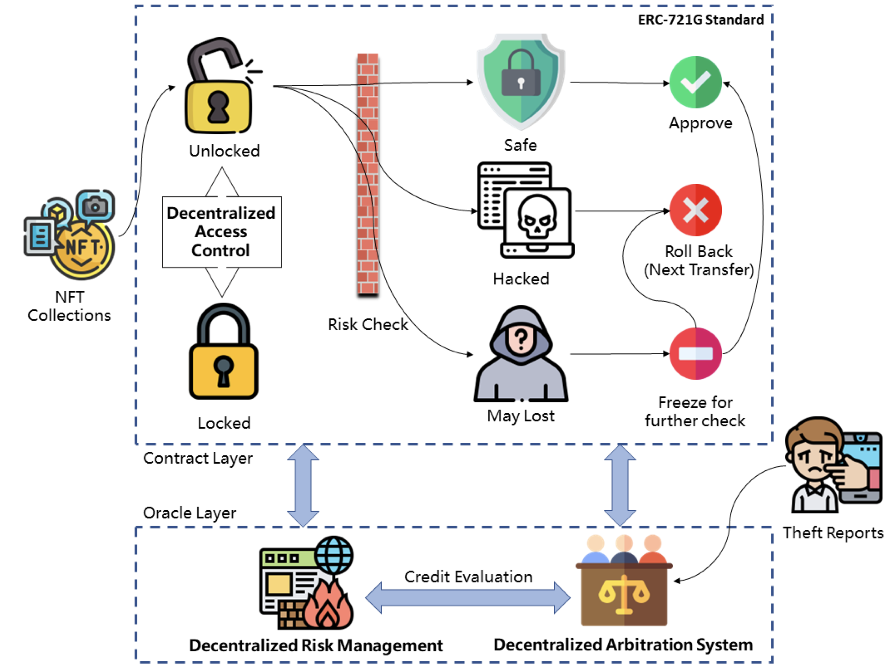

[![NPM][npm-shield]][npm-url]
[![Issues][issues-shield]][issues-url]
[![MIT License][license-shield]][license-url]
<!-- OTHER BADGES -->
<!-- [![Contributors][contributors-shield]][contributors-url] -->
<!-- [![Forks][forks-shield]][forks-url] -->
<!-- [![Stargazers][stars-shield]][stars-url] -->
<!-- [![Docs][docs-shield]][docs-url] -->
<!-- [![Coverage][coverage-shield]][coverage-url] -->

<!-- ANNOUNCEMENT -->

> **📢 To depoly the contracts on mainnet, please contact our technical support that add your major contracts' addresses to the trusted list**

_The major contract of ERC721G is based on Azuki's [ERC721A](https://github.com/chiru-labs/ERC721A), thanks a lot._

## Background

Since the circulation of NFT, there have been many incidents of theft. These incidents are mainly caused by private key theft and phishing attacks, and in the existing cases, it is difficult to recover once stolen. Most recovered cases also require a second offer from the stolen person, which is very costly. We propose a universal technical solution to be adapted to any ERC721 standard smart contract to help NFT holders guard their property security jointly.

<!-- ABOUT THE PROJECT -->

## About The Project
### ERC721G

ERC721G is the world's first NFT anti-theft smart contract with three main features: "upgradeable," "scalable," and "secure." Dedicated to NFT asset protection, make Web3 a better place, and more people believe in it.

The first use case for ERC721G is the TurtlecaseGang NFT project, which proved the smart contract’s validity during several hacking events ( Premint websites hacking and Discord exploit incidents). For project details, visit https://opensea.io/collection/turtle-case-gang.


### Big Brother

An offically implementation of **TokenPatronus**, know more about our [whitepaper](https://arxiv.org/abs/2208.05168).

To cooperate with the ERC721G anti-theft contract to play an effective role, we have launched a set of risk control system: BigBrother. The BigBrother risk control system is an NFT anti-theft protection solution with multi-dimensional analysis and optimistic consensus voting mechanism. It helps NFT holders protect property safety through pre-protection, mid-blocking, and post-compensation. The system has three main parts: operation and maintenance strategy management, intelligent risk analysis, and real-time monitoring of changes.



<!-- Docs -->

## Docs

Coming soon

<!-- Upgradeable Version -->

## Upgradeable Version

Coming soon

<!-- Installation -->

## Installation

```sh

npm install --save-dev @turtlecasedao/erc721g

```

<!-- USAGE EXAMPLES -->

## Usage

Once installed, a basic example on how to inherit the ERC721G in your contract would look like the following. 

```solidity
pragma solidity ^0.8.15;

import "erc721g/contracts/ERC721G.sol";

contract TurtleCaseGang is ERC721G {
    constructor() ERC721G("TurtleCase Gang", "TCG") {}

    function mint(uint256 quantity) external payable {
        // `_mint`'s second argument now takes in a `quantity`, not a `tokenId`.
        _mint(msg.sender, quantity);
    }
}
```

## Binding

When you want to enable `Guard` mode, please refer to `sample_scripts/bind.js` to enable the Gaurd mode of ERC721G. You may need to KYC with official technical support for registry on bigbrother oracle.

## Sample .env

```
PRIVATE_KEY=    # Your Private Key, NEVER show this to others
API=            # Get this from Infura or other provider
PUBLIC_KEY=     # Your Public Key
NETWORK=rinkeby # or mainnet
API_KEY=        # Get this from Infura or other provider
COINMARKET_KEY= # Get this from coinmarketcap if need
ERC721_ADDR=    # Your own ERC721G address
ORACLE_ADDR=0x025838C946Ed0F3182AF9914296fb9cecDBd2C94
REPORT_GAS=true
REPORT_COVERAGE=true
```

<!-- ROADMAP -->

## Roadmap

- [ ] Release features of Reclaim/Judge to ERC721G/BigBrother
- [ ] Make decentrialized risk engine(BigBrother) open source
- [ ] Improve general repo, add more documentation and test cases

<!-- CONTRIBUTING -->

## Contributing

Because of **ERC721G/BigBrother** is not only a smart contract, but a fully featured solution, contributions to the project will be worked on both ERC721G and BigBrother. 

There is **very welcome** everybody to join this open source community. Any contributions you make are greatly appreciated.

<!-- ROADMAP -->

### Running tests locally

1. `npm install`
2. `npm run test`

<!-- LICENSE -->

## License

Distributed under the MIT License. See `LICENSE.txt` for more information.

<!-- CONTACT -->

## Contact

- zhenyi.eth (owner) - [@soczhenyi](https://twitter.com/soczhenyi)
- 0xSilence (owner) - [@0xsilence](https://twitter.com/0xsilence)
- Masa (owner) - [@drmaasaa](https://twitter.com/drmaasaa)
- 2fr0gs (maintainer) - [@richardfrog](https://twitter.com/richardfrog)
- SalutMo (maintainer)

Technical Support: [https://github.com/turtlecasedao/OpenERC721G](https://github.com/turtlecasedao/OpenERC721G)

Project Link: [https://github.com/turtlecasedao/OpenERC721G](https://github.com/turtlecasedao/OpenERC721G)

[license-shield]: https://img.shields.io/badge/License-MIT-green.svg?style=for-the-badge
[license-url]: https://github.com/turtlecasedao/OpenERC721G/blob/main/LICENSE
[npm-shield]: https://img.shields.io/npm/v/@turtlecasedao/erc721g.svg?style=for-the-badge
[npm-url]: https://www.npmjs.com/package/@turtlecasedao/erc721g
[issues-shield]: https://img.shields.io/github/issues/turtlecasedao/OpenERC721G.svg?style=for-the-badge
[issues-url]: https://github.com/turtlecasedao/OpenERC721G/issues